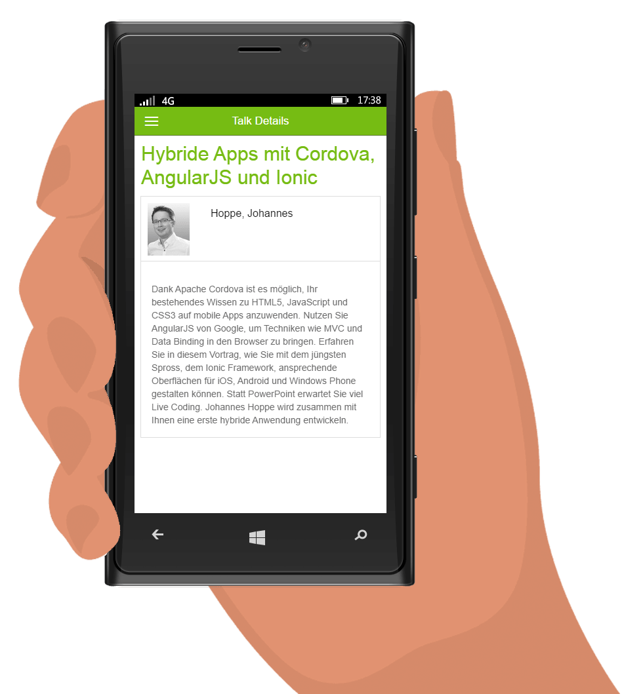

# Vortrag + Demo Code

## Apache Cordova  und Frameworks für hybride Apps

Apps für Android und iOS müssen nicht in JAVA oder Objective-C entwickelt werden. Mit zunehmender Performance auf den mobilen Geräten gewinnen hybriden Apps wieder an Boden. Mithilfe von HTML5, JavaScript und z.B. Apache Cordova (vormals PhoneGap genannt) lassen sich bestehend Teams, bekannte Tools und Web-Know-how weiter verwenden. Doch mit der Entscheidung für eine hybride Anwendung steht die Wahl einer geeigneter JavaScript Bibliothek an. Sollte die Anwendung MVVM unterstützen oder sind klassische Ansätze empfehlenswert? Wie kann eine hybride Anwendung ein natives Aussehen erhalten? Johannes Hoppe beantwortet Ihre Fragen und stellt Ihnen drei mobile Frameworks vor. Erfahren Sie, wo die Stärken und Unterschiede bei Bootstrap & Knockout, jQuery Mobile sowie Kendo UI Mobile liegen. Hierfür entwickelt Johannes Hoppe live in Visual Studio und mit Apache Cordova eine App zur Anzeige der DWX-Sessions.

## [» Präsentation Starten](http://johanneshoppe.github.io/HybridApps/)
## [» Dokumentation lesen](http://johanneshoppe.github.io/HybridApps/Docs/)

## App ausprobieren
Android: https://play.google.com/store/apps/details?id=com.telerik.DwxDemoApp  
Windows Phone: http://www.windowsphone.com/en-us/store/app/demo-app-zur-dwx/cd5c1536-5690-4dea-a068-f1e5cb951703  
iOS: ?  